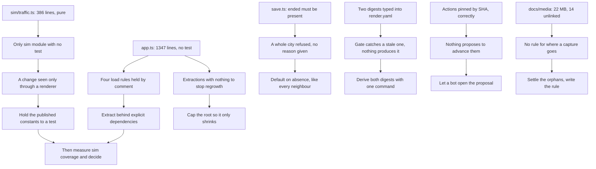

## prod_038_a_repository_that_keeps_its_own_rules_without_being_reminded - A repository that keeps its own rules without being reminded
> Date: 2026-09-07
> Status: Proposed
> Related request: `req_051_review_findings_a_save_the_parser_refuses_sim_seams_no_test_reaches_and_gates_kept_by_hand`
> Related backlog: `item_176_accept_a_run_block_that_omits_its_end_reason`, `item_177_hold_the_driving_constants_sim_traffic_publishes_to_their_own_test`, `item_178_move_city_loading_out_of_the_composition_root_and_cap_that_root_s_growth`, `item_179_derive_the_csp_hashes_from_index_html_instead_of_transcribing_them`, `item_180_measure_simulation_coverage_before_deciding_whether_to_gate_on_it`, `item_181_let_a_bot_move_the_pinned_action_shas_and_the_in_range_dependencies`, `item_182_clear_the_scratch_copies_the_hidden_script_and_the_regenerable_screenshots`, `item_183_settle_the_unreferenced_review_screenshots_and_say_where_a_new_one_goes`
> Related task: `task_053_orchestrate_the_0_5_1_review_findings`
> Related architecture: (none yet)
> Reminder: Update status, linked refs, scope, decisions, success signals, and open questions when you edit this doc.

# Overview
Every rule this repository already believes in is enforced by something that runs, not by someone remembering - and the seams the tests need are reachable before the module gets large enough to hide them.

# Goals
- A parser that defaults on absence everywhere, so no field is stricter than its neighbours by accident.
- Every pure simulation module reachable by its own test, with no exception left standing.
- A composition root that can only shrink, so each extraction is permanent rather than a moment of good intent.
- Values a gate checks are produced by a command, never transcribed by hand into a second file.
- Pinned dependencies that something proposes to advance, so pinning is discipline rather than dormant debt.
- A working tree and a media directory whose weight and contents are the result of a stated rule.

# Non-goals
- Coverage percentages over rendering code, which executing a Babylon line does not evidence.
- Running the browser suites on GPU-less CI runners, already settled by prod_003.
- An engine facade, ECS, state framework or dependency-injection layer.
- Any history rewrite, which would break the commit SHAs the release evidence cites.
- Changing rendering or simulation behaviour: the only behaviour change in scope is the save parser accepting an absent end reason.

# Scope and guardrails
- In: one save-parser defect, the last untested pure simulation module, the composition root's
  growth, the digests a gate checks but nothing produces, the pinned dependencies nothing
  advances, and the weight the media directory gains once per delivery wave.
- In: writing down two rules that are currently held by habit - where a delivery capture goes,
  and what the composition root's line ceiling is.
- Out: rendering and driving behaviour. The single behaviour change in scope is the parser
  accepting an absent end reason.
- Out: an engine facade, ECS, state framework or DI layer, per the project context in LOGICS.md.
- Out: any history rewrite, and therefore git-lfs on the existing history.
- Out: the browser suites moving into CI, already settled by prod_003.

# Key product decisions
- A rule the repository believes in is enforced by something that runs, or it is not a rule.
  Seven of the eight slices convert a reminder into a command, an assertion, or a bot.
- The gate is kept and the producer is added. The CSP assertion in tests/architecture.mjs
  already cannot let a stale header ship; what is missing is the command that computes the value.
- Measure before gating. Coverage is scoped to src/sim, where it means something, is measured
  after the tests that change it land, and is set no higher than the level actually reached.
- Cap what you cannot finish. The composition root gets a ceiling that can only be lowered, so
  each extraction is permanent and the next one is someone else's turn rather than nobody's.
- Correct pinning still needs something to move it. SHA-pinned actions stay pinned; a bot opens
  the proposal and npm run ci plus a human stay in the path.
- Prefer deletion with a written rule over accumulation with none: the 14 unreferenced captures
  are settled one way or another, and CONTRIBUTING states where the next one goes.

# Success signals
- A city whose run block omits its end reason loads and plays.
- Every module in src/sim has a colocated test, with no exception left standing.
- app.ts cannot grow past its recorded ceiling without failing a test.
- Editing the inline style and running one command leaves the CSP assertion green.
- An action SHA advances by proposal rather than by someone remembering.
- Every file in docs/media is linked, recorded as externally cited, or gone.

# References
- Product back-reference: `req_051_review_findings_a_save_the_parser_refuses_sim_seams_no_test_reaches_and_gates_kept_by_hand`
- Task back-reference: `task_053_orchestrate_the_0_5_1_review_findings`
