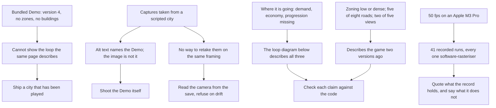

## prod_039_a_shop_window_that_shows_the_game_that_exists - A shop window that shows the game that exists
> Date: 2026-09-07
> Status: Settled
> Related request: `req_052_ship_the_played_demo_city_reshoot_the_readme_from_it_and_stop_the_readme_overstating_what_is_missing`
> Related backlog: `item_184_replace_the_bundled_demo_with_a_city_that_has_been_played`
> Related task: `task_054_orchestrate_the_demo_swap_and_readme_correction`
> Related architecture: (none yet)
> Reminder: Update status, linked refs, scope, decisions, success signals, and open questions when you edit this doc.
> Indicators reviewed: 2026-09-07 14:33:41

# Overview
The README and the bundled Demo are what a visitor meets first, and both were describing an older game than the one that ships.

# Goals
- A sample city that can demonstrate the loop the documents describe, because it has been played through it.
- Captures that come from that city, on the framing it carries, retakeable by one command.
- Feature claims checked against the code rather than remembered from when they were written.
- No performance figure that the repository's own record cannot source.

# Non-goals
- The deployment documents - the security policy, the supported-versions table, the input model - which prod_010 already settled.
- The benchmark fixture perf/cities/ma-ville.json, whose comparability req_045 established deliberately.
- A real-GPU measurement, which needs different launch flags and is its own work.
- Any change to the game itself: this is what the project says about itself, not what it does.

# Scope and guardrails
- In: the bundled Demo city, the three README captures, and every claim the README makes about
  what the game has, does not have, and costs to run.
- Out: the deployment documents - security policy, supported versions, input model - settled by
  prod_010. This brief is about the description of the game, not of the deployment.
- Out: perf/cities/ma-ville.json, the large-demo-v14 baseline req_045 established.
- Out: the game itself. Nothing here changes behaviour.

# Key product decisions
- The sample city is played, not built. A scripted fixture can be made to look right; a save
  exported from a real run cannot lie about whether the loop works.
- The framing belongs to the save. A capture script that sets its own camera has to be kept in
  agreement with the fixture by hand; one that reads the save's camera and refuses to shoot when
  the live camera has drifted cannot fall out of agreement quietly.
- A claim about the game is checked against the code, once, at the point of writing it. The three
  diagrams survived that check unchanged; four prose claims did not.
- A number without a source in perf/history.jsonl does not appear. Saying no device frame rate has
  been measured is worth more than a figure nobody can reproduce.

# Success signals
- The city a first-time visitor loads shows zoning, buildings, traffic, an economy and a wave.
- One command retakes all three README captures, and refuses if the framing has drifted.
- Every feature the README names exists, and every feature it calls missing is missing.
- No performance figure in the README is unsourceable.

# References
- Product back-reference: `item_184_replace_the_bundled_demo_with_a_city_that_has_been_played`
- Task back-reference: `task_054_orchestrate_the_demo_swap_and_readme_correction`
