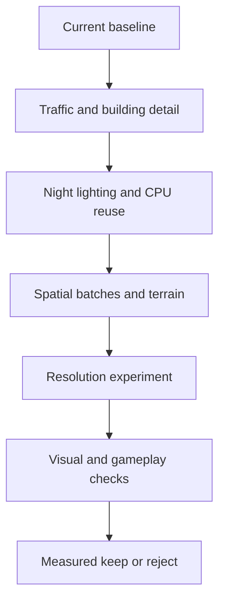

## prod_040_a_smoother_city_near_and_far_without_losing_the_distant_city - A smoother city near and far without losing the distant city
> Date: 2026-09-07
> Status: Settled
> Related request: `req_054_deliver_measured_distance_aware_city_performance`
> Related backlog: `item_187_repair_performance_readiness_and_establish_comparable_distance_baselines`
> Related task: `task_055_deliver_and_validate_the_distance_aware_performance_slices`
> Related architecture: (none yet)
> Reminder: Update status, linked refs, scope, decisions, success signals, and open questions when you edit this doc.
> Indicators reviewed: 2026-09-07 18:53:55

# Overview
Improve camera movement and running-city frame times while keeping distant traffic alive, the nighttime city readable, and roads/terrain accurate. Use existing detail controls and shared assets; select added rendering complexity only when comparable measurements support it.

# Goals
- Render visible detail at useful distances without changing offscreen simulation.
- Reduce measured nighttime and CPU frame costs while preserving city readability and deterministic gameplay.
- Make every performance decision reproducible on the current assets and reference city.
- Separate FPS, tail stalls, resolution quality and loading/memory concerns.

# Non-goals
- Asset streaming, engine/ECS rewrites, additional rendering dependencies or simulation LOD.
- Guaranteed FPS on unspecified hardware or additive interpretation of ablation ratios.
- Automatic quality degradation, default cap changes, economic balance changes or a graphics-preset framework.

# Scope and guardrails
- In: benchmark repair, bounded traffic visuals, automatic boxes, distant light experiments, policy-specific CPU cache reuse, spatial static batches, terrain tiling/LOD experiments and a conditional resolution control.
- Keep distant simulation running, shared models resident, original terrain/pick accuracy, default 60 FPS cap and current graphics quality by default.
- Visibility must compose with player toggles, tools, selection/follow and offscreen shadow casters; proximity is not permission to change game state.
- Conditional prototypes require a measured keep/reject verdict. A rejected experiment is removed and its result preserved.

# Key product decisions
- Unchecked force-boxes selects automatic detail; checked forces boxes at every camera radius. Keep the stored preference compatible and explain the updated meaning accessibly.
- Distant lighting must preserve road/facade readability and emissive identity. Do not trade FPS for an unexplained dark city.
- Spatial groups and terrain detail stay renderer concerns; the road graph and full-resolution heightmap remain authoritative.
- Start with 200 ms traffic visibility checks, 320-2000 m candidate reach and 15% hysteresis, and global boxes at 1100/1000 m. Tune from measurements, not historical claims.
- Use shared retention criteria: three comparable A/B pairs, stable direction, at least 5% target median or p95 frame-time improvement and no greater than 5% control regression; visual/correctness defects always reject. Resolve noise with longer measurements.
- Resolution changes are optional, explicit and persisted; no automatic quality degradation or broad preset system.

# Success signals
- Every candidate is reproducible using the current asset catalog and reference city, with actual GPU and rendered resolution recorded.
- Accepted changes improve the targeted running-city or moving-camera budget without regressions in overview, selection, terrain or simulation outcomes.
- The final report distinguishes steady frames, p95/p99 stalls, load/edit latency and visual quality; it never adds ablation gains together.
- Every conditional candidate has a measured implementation or rejected experiment; no promised percentage of total FPS.

# Open questions
- Tile size, distant light representation, useful terrain LOD and lower-quality buffer settings are implementation experiments with explicit gates, not unanswered product permissions.
- Asset-memory pressure and streaming are outside this delivery; retain shared models unless a later memory investigation establishes a need.

# Overview diagram

# References
- Product back-reference: `item_187_repair_performance_readiness_and_establish_comparable_distance_baselines`
- Task back-reference: `task_055_deliver_and_validate_the_distance_aware_performance_slices`
