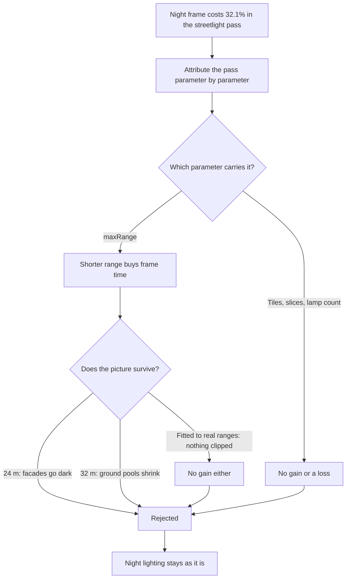

## prod_041_a_city_that_stays_readable_at_night_without_paying_twice_for_it - A city that stays readable at night without paying twice for it
> Date: 2026-09-07
> Status: Settled
> Related request: `req_055_reduce_the_clustered_night_lighting_pass`
> Related backlog: `item_195_attribute_the_clustered_container_pass_cost_before_changing_it`
> Related task: `task_056_deliver_the_measured_night_lighting_pass_reduction`
> Related architecture: (none yet)
> Reminder: Update status, linked refs, scope, decisions, success signals, and open questions when you edit this doc.
> Indicators reviewed: 2026-09-07 20:08:04

# Overview
Night is the most expensive time of day in this city, and the cost sits in the lighting pass rather than in the lamps a player can see. Recover what is recoverable, and say plainly what is not.

# Goals
- A night frame that costs less without the streets going dark.

# Non-goals
- A new lighting engine, generated textures, removing the player's lights switch, or revisiting distance-based lamp culling already rejected on measurement.

# Scope and guardrails
- In: scaffolded request, product, backlog, orchestration task, validation, and handoff context.
- Out: unrelated workflow docs and implementation of generated tasks.

# Key product decisions
- Use structured input as the source of truth for generated docs.
- Keep generated write paths local and repo-bounded.

# Success signals
- Generated docs pass lint and audit without broad manual rewrites.
- Context-pack output can be handed to an implementation agent directly.

# References
- Product back-reference: `item_195_attribute_the_clustered_container_pass_cost_before_changing_it`
- Task back-reference: `task_056_deliver_the_measured_night_lighting_pass_reduction`
